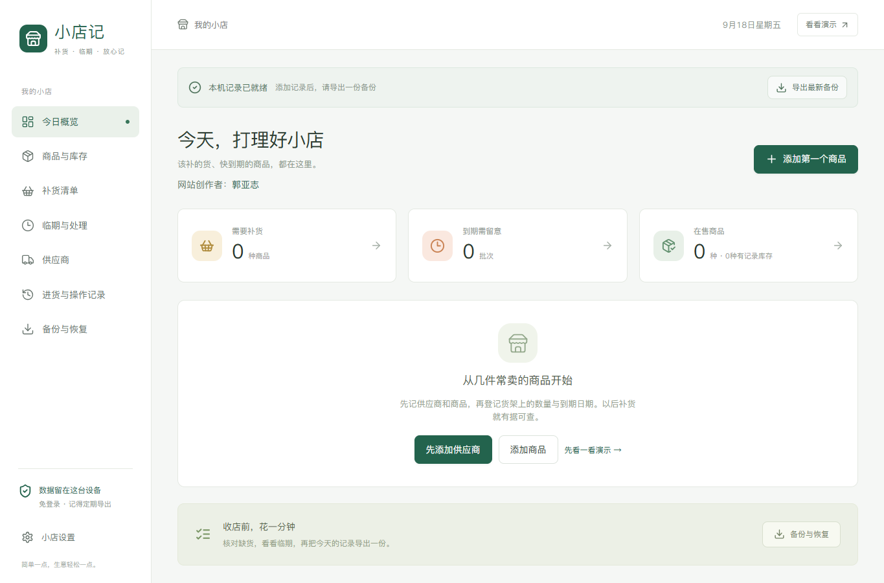
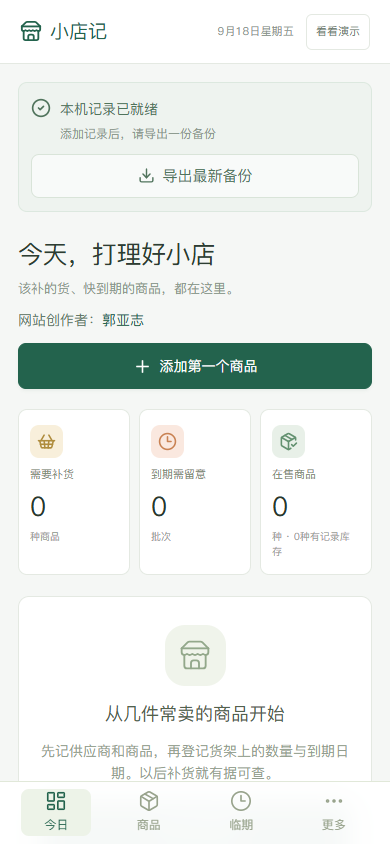

# 小店记 Xiaodianji

面向家庭超市的补货与临期管理助手。手机浏览器打开即可使用，支持本地数据保存、离线使用和手动备份，无需业务账号登录。

**原作者：郭亚志 · 许可证：[MIT](LICENSE)**

这是可独立运行、修改和部署的开源源码。下载或 Fork 后，使用自己的托管账号创建新网站，即可获得自己的网址。此仓库不包含原站的部署授权、管理文件或真实店铺数据，也没有自动发布工作流。

## 功能

- 商品及供应商建档，记录规格、包装数量、联系人和报价。
- 按同规格商品的最小计数单位对比供应商价格。
- 按记录库存和补货目标生成清单，按供应商分组，自行复制给供货方。
- 登记实际到货，同时保存进货历史、库存批次和价格。
- 按批次记录到期日，查看临期、过期和优先处理商品。
- 修改前核对，保存结果明确；保存后提示导出最新备份。
- JSON 备份校验、导入预览、恢复确认，以及找回上一次恢复前的数据。
- 演示模式与正式数据分离，可以先看演示熟悉界面。

## 界面预览

桌面：



手机：



## 在电脑上运行

安装 Node.js 22 或以上版本，推荐 Node.js 24 LTS（自带 npm）。将项目解压到自己的目录，在包含 `package.json` 的文件夹打开终端：

```sh
npm ci
npm run dev
```

打开终端显示的地址，默认是 `http://localhost:5173/`。不需要 API Key、环境变量或数据库服务器。正式数据初始为空，示例商品只在演示模式出现。

本机开发服务器默认监听局域网；只在本机预览时可以使用：

```sh
npm run dev -- --host 127.0.0.1
```

## 测试和构建

```sh
npm test
npm run build
npm run preview
```

构建生成 `dist/`。预览地址默认 `http://localhost:4173/`；离线功能需要生产构建、浏览器成功安装缓存，以及 HTTPS 或 localhost。

浏览器回归测试：

```sh
npm run test:browser
```

Windows 默认使用已安装的 Microsoft Edge。macOS/Linux 先运行 `npx playwright install chromium`；Linux 如缺少系统依赖，可使用 `npx playwright install --with-deps chromium`。测试会创建隔离浏览器会话，默认开发测试端口是 4174。

2026-09-19 已在独立目录从本源码包执行 `npm ci`，通过 25 项数据测试、2 项浏览器回归测试及生产构建。测试环境为 Windows、Node.js 24 和 Microsoft Edge；其他设备的下载与安装体验需自行验证。

## 仿照这个项目开发自己的网站

1. 下载源码或 Fork 到自己的 GitHub 账号。
2. 按上面的命令在本机运行。
3. 阅读 [开发思路与代码结构](docs/开发指南.md)，找到要修改的页面和规则。
4. 修改自己的副本，运行测试和构建。
5. 按 [部署自己的网站](docs/部署自己的网站.md)，在自己的 Netlify 账号中创建新站点，上传 `dist`。

默认配置按域名根路径部署。若使用 GitHub Pages 的 `/仓库名/` 子路径，需另外调整 Vite 基础路径、图标路径和 PWA 配置；本说明采用更直接的根路径托管。

## 技术栈

| 技术 | 用途 |
| --- | --- |
| React、TypeScript、Vite | 页面、类型检查、开发与构建 |
| CSS、Lucide React | 响应式布局及图标 |
| IndexedDB、idb | 浏览器本地数据库和事务保存 |
| Zod | 输入、关联数据与备份结构校验 |
| vite-plugin-pwa、Workbox | 缓存生产网页、支持离线加载 |
| Vitest、fake-indexeddb | 业务规则、持久化和恢复测试 |
| Playwright | 表单操作与网络提示回归测试 |

## 数据保存与使用边界

- 这是单设备本地工具，没有云端业务数据库，也不会自动在多人或多个设备之间同步。
- 微信扫码收款不会自动扣减库存。补货前应按批次核对货架剩余数量。
- 保质期以商品包装为准；关闭网页后没有后台消息推送。
- 关闭重开可以继续读取同一浏览器、同一网址的记录，但无痕模式、清理网站数据、卸载浏览器或丢失手机可能导致数据丢失。
- 保存到浏览器不等于备份完成。每天导出 JSON，确认下载成功，并另存到其他设备。
- 换网址或浏览器前应先导出，在新位置导入。不同人访问同一个公开网址，读取的是各自浏览器里的数据。
- 备份的 SHA-256 用来发现损坏，不是加密或身份认证；备份内容仍需要自行保管。

详见 [手机使用说明](docs/手机使用说明.md)。

## 开源与线上网站的关系

Public 仓库让别人查看源码。Fork、下载和修改代码，只会影响他们的副本；这不会自动授予原仓库写权限，也不会授予原网站的 Netlify 发布权限。Pull Request 是供维护者审核的修改建议，不会自动合并。

仓库所有者应自行管理协作者、托管团队和部署令牌的权限。本开源包没有绑定原网站的站点 ID，也不含 GitHub Actions 发布脚本。不要把管理令牌或真实店铺备份提交到公开仓库。

## 参与改进与许可证

欢迎通过 Issue 描述问题，或 Fork 后提交 Pull Request；具体流程见 [CONTRIBUTING.md](CONTRIBUTING.md)。

项目采用 MIT License，允许使用、修改、分发和商业使用，分发时请保留版权声明与许可证。MIT 本身不强制网页显示作者姓名。第三方依赖遵循各自许可证；通过 npm 安装时获取相应依赖及其许可文件。
